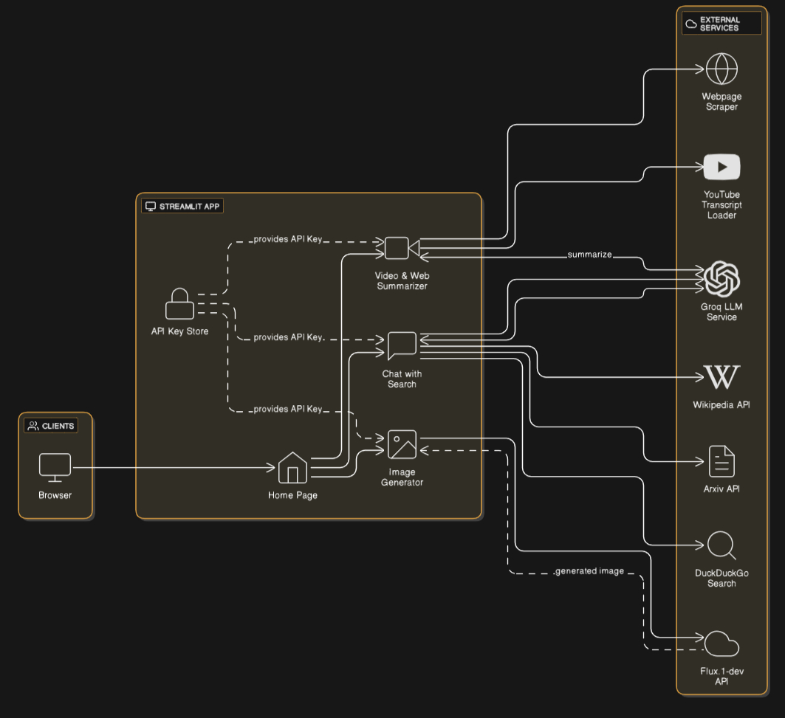

# 🤖 Multi-Agent AI Platform



A powerful **Multi-Agent System** built with a modular architecture to perform:
- Video & Web summarization
- Conversational search
- AI-powered image generation

This Streamlit-based app coordinates multiple agents to communicate with various external APIs and services, including LLMs, Wikipedia, Arxiv, and DuckDuckGo — enabling intelligent, user-facing applications.

---

## 🚀 Key Features

### 🧠 Agents
- **Video & Web Summarizer**: Uses Groq LLMs and web/YT scrapers
- **Chat with Search**: Conversational agent with knowledge access
- **Image Generator**: Generates contextual images from user prompts

### 🔌 External Services
- **Groq LLM Service** – Fast LLM-based reasoning and summarization
- **Wikipedia API** – Structured encyclopedia lookup
- **Arxiv API** – Scientific paper access
- **DuckDuckGo Search** – General web search
- **Flux API** – Image generation support
- **YouTube Transcript Loader** – Extracts captions for analysis
- **Webpage Scraper** – Summarizes article content

### 🔐 Secure
- Built-in **API Key Store**: Dynamically injects API keys into agents at runtime

---

## 📦 Tech Stack

- **Frontend**: [Streamlit](https://multiagentio.streamlit.app/)
- **Backend**: Python multi-agent architecture
- **APIs**: LLMs, Wikipedia, Arxiv, YouTube, DuckDuckGo, Flux
- **Browser**: Runs client-side in any modern browser

---

## 🛠️ Setup Instructions

### 1. Clone the Repository

```bash
git clone https://github.com/your-repo/multi-agent-app.git
cd multi-agent-app
